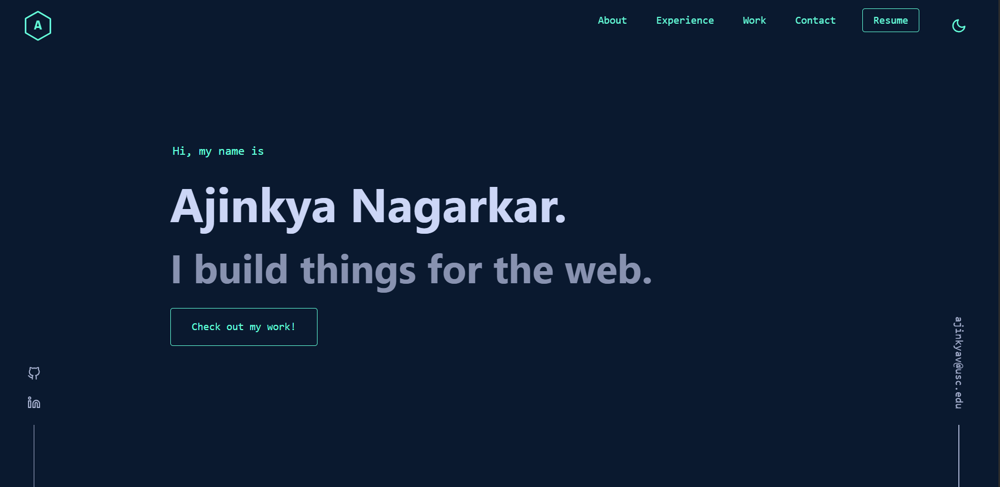
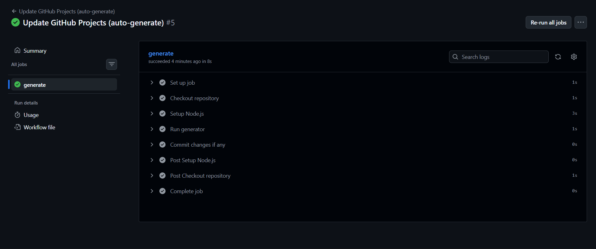

# Developer Portfolio — CI/CD-Driven Content System

This repository contains the source code and automation pipeline for my personal developer portfolio.



The portfolio is designed as a **content-driven system** backed by a **CI/CD pipeline**, ensuring that:

- Resume content remains the single source of truth
- Featured projects remain manually curated
- GitHub projects are automatically synchronized without manual intervention

---

## 🌐 Live Links

- **Portfolio:** https://ajinkya-nagarkar.vercel.app/
- **Resume:** ./public/resume.pdf

---

## 🧩 System Overview

The portfolio operates on a **hybrid content model**:

- **Static content**
  - Personal details
  - Education
  - Experience
  - Skills
  - Featured projects

- **Dynamic content**
  - Public GitHub repositories
  - Auto-generated via CI/CD

This separation guarantees stability of curated content while enabling automated updates where appropriate.

---

## 🗂️ Repository Structure

```txt
config/
 └─ content/
    ├─ personal.ts
    ├─ education.ts
    ├─ experience.ts
    ├─ skills.ts
    └─ projects/
       ├─ featured.ts     # Manually curated projects
       ├─ manual.ts       # Static additions
       └─ github.ts       # Auto-generated (CI output)
scripts/
 └─ generateGithubProjects.js
.github/
 └─ workflows/
    └─ update-github-projects.yml
```

### ⚠️ github.ts is generated by the CI pipeline and should not be edited manually.

## ⚙️ CI/CD Pipeline — GitHub Projects Sync

A GitHub Actions CI/CD pipeline automatically synchronizes GitHub repositories into the portfolio.

**Pipeline Capabilities**

- Scheduled execution (weekly)
- Manual trigger support
- GitHub API integration
- Deterministic file generation
- Safe commits (only when changes exist)

### Workflow

```text
.github/workflows/update-github-projects.yml
```

Execution Flow

1. Pipeline triggers (cron or manual)
2. GitHub API fetches public repositories
3. Data is normalized and formatted
4. github.ts is regenerated
5. Changes are committed only if a diff exists

## 🔐 Configuration & Security

### Required Repository Variable

```text
PORTFOLIO_GITHUB_USERNAME=<github-username>
```

### Authentication

- Uses GitHub-provided GITHUB_TOKEN

- Scoped permissions via:

```yaml
permissions:
  contents: write
```

**No personal access tokens are required.**

## ▶ Manual Pipeline Execution

The workflow supports manual execution with an optional override.

**Path:**

Actions → Update GitHub Projects → Run workflow

**Optional input:**
- `github_user` — temporarily overrides the default configured GitHub username

---

## 🛡 Design Guarantees

- Featured projects are never overwritten
- Resume-aligned content remains stable
- CI output is deterministic and reproducible
- No-op commits are avoided
- Pipeline fails fast on misconfiguration

---

## 🧰 Tech Stack

- **Frontend:** React / Next.js
- **Language:** TypeScript
- **Styling:** Tailwind CSS
- **CI/CD:** GitHub Actions
- **Automation:** Node.js scripts
- **Deployment:** Vercel

## 📸 Screenshots

Screenshots of the live portfolio and CI/CD pipeline execution can be found below.




---

## 📬 Contact

- **GitHub:** https://github.com/Ajinkya-Nagarkar
- **LinkedIn:** https://www.linkedin.com/in/ajinkya-nagarkar-2063a2195/

---

This repository reflects a **production-minded approach** to content integrity, automation, and maintainability, rather than a purely static portfolio.